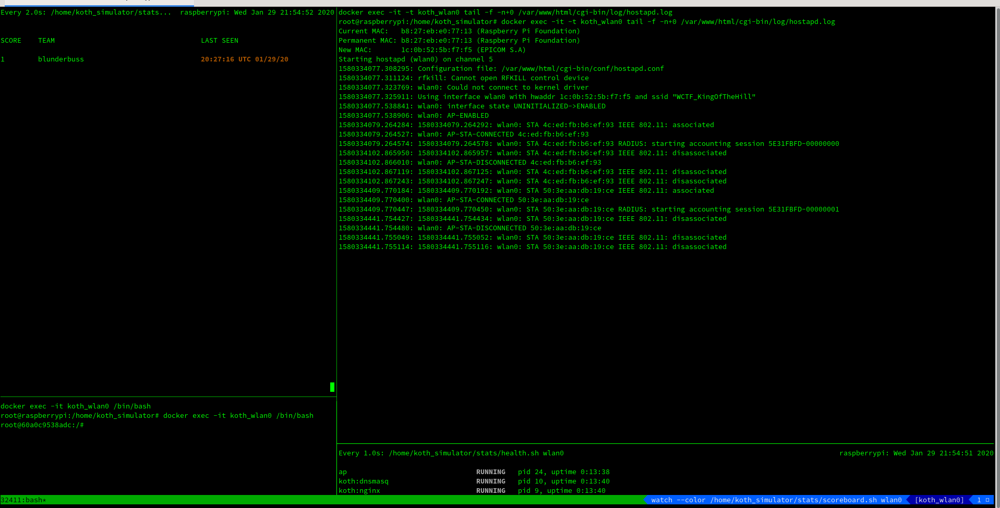

# WCTF KOTH Game

The Wireless Village hosts a King of the Hill (KOTH) competition which forces teams to submit their team name to the WCTF_KingOfTheHill AP as many times as possible. With each successful submission the AP becomes locked for 60 seconds at which time no team can submit their team name and score. Once the 60 seconds have expired the AP becomes active again at which time all teams compete again to score.

Upon connecting to the WCTF_KingOfTheHill AP teams need to obtain a DHCP lease, then navigate to 172.16.100.1 (this IP has been known to change with each con) and submit their team name. Submitting the team name logs the team's success! Weighted points are awarded to the teams with successful submissions at the conclusion of the WCTF; as long as there is a minimum of 30 submissions the points are awared. Oh, and this challenge does not sleep when they close the doors for the night.

The code in this repo is just a very poor attempt at a simulation of this KOTH game. We have no knowledge of how the real KOTH implementation works or how it is built. This project is simply a means to test our own custom defense and offense scripts.

# Installing

Docker is being used here to help avoid conflicts with the local running system (webserver, network, ...). The install instructions are fairly generic which should allow the simulation to run on most hosts.

Arch Linux - x86_64
```
pacman -S docker
systemctl start docker
```

Ubuntu 16.04 - x86_64
```
apt-get install docker
systemctl start docker
```

Ubuntu 18.04 - x86_64
```
sudo apt-get remove docker docker-engine docker.io containerd runc

sudo apt-get update
sudo apt-get install \
    apt-transport-https \
    ca-certificates \
    curl \
    gnupg-agent \
    software-properties-common

curl -fsSL https://download.docker.com/linux/ubuntu/gpg | sudo apt-key add -

sudo add-apt-repository \
   "deb [arch=amd64] https://download.docker.com/linux/ubuntu \
   $(lsb_release -cs) \
   stable"

sudo apt-get update
sudo apt-get install docker-ce docker-ce-cli containerd.io
```

Kali on RPi 3 model B - aarch64
```
curl -fsSL https://download.docker.com/linux/debian/gpg | sudo apt-key add -
echo 'deb https://download.docker.com/linux/debian stretch stable' > /etc/apt/sources.list.d/docker.list
apt-get update 
apt-get remove docker docker-engine docker.io
apt-get install docker-ce
```

Raspbian on RPi 3 model B+ - armv7l
```
curl -fsSL https://download.docker.com/linux/debian/gpg | sudo apt-key add -
echo 'deb https://download.docker.com/linux/debian stretch stable' > /etc/apt/sources.list.d/docker.list
apt-get update 
apt-get remove docker docker-engine docker.io
apt-get install docker-ce
```

Raspbian Buster on RPi 4
```
apt-get update
apt-get upgrade
reboot
curl -fsSL https://download.docker.com/linux/debian/gpg | sudo apt-key add -
echo 'deb https://download.docker.com/linux/debian stretch stable' > /etc/apt/sources.list.d/docker.list
apt-get update
apt-get remove docker docker-engine docker.io
apt install --no-install-recommends docker-ce
```

# Requirements

Aside from only presently supporting a few hosts, the selected nic to use for the simulation must support <b>set_wiphy_netns</b>. This is because of the network namespacing in use. The run.sh script does an explicit check of this condition. You can also check the device itself with:
```
iw phy phy<#> info | grep set_wiphy_netns 
```
The adapter must also support AP interface mode. The run.sh script does an explicit check of this condition. You can also check the device itself with:
```
iw phy phy<#> info | grep -E "\* AP\s*$"
```
If you don't have adequate harware you can always setup a local environment using mac80211_hwsim and use one of the virtual nics as the KOTH ap and the other nic to test connection.
```
# insmod mac80211_hwsim.ko.xz radios=2
```


# Configuring the build
The <i>wlan_config.txt</i> file allows a few runtime parameters to be set during the build. All parameters are optional with the build providing sensible defaults otherwise:
* KOTH_SSID: The broadcasted ssid of the KOTH ap. Defaults to WCTF_KingOfTheHill
* KOTH_IP: The landing address for team scoring. Defaults to 172.16.100.1
* KOTH_SCOREBOARD: An absolute path to a file which holds the scoreboard. The supplied file is bind mounted inside the container which will persist beyond the lifetime of the container. The file will exist at <i>/var/www/html/cgi-bin/teams.txt</i> inside the container. If this value is not set then scores will still be recorded to <i>/var/www/html/cgi-bin/teams.txt</i> however all scores will be <b>lost</b> once the container is stopped.
* KOTH_FIVEGHZ: Only use channels on the 5GHz band for the selected interface. Defaults to 0. If this option is selected (set to 1) then be sure your adapter supports from the 5s.
* KOTH_24GHZ: Only use channels on the 2.4GHz band for the selected interface. Defaults to 0.

# Running

The <i>run.sh</i> script is all that is needed to start and stop the simulation. The very first run can take some time as the initial docker image is being built.
```
#./run.sh start wlan0

  _  _____ _____ _  _     _   ___ 
 | |/ / _ \_   _| || |   /_\ | _ 
 |   < (_)  | | | __ |  / _ \|  _/
 |_|\_\___/ |_| |_||_| /_/ \_\_| 

Do you want to play a game...

[+] Docker seems to be installed and started
[+] Stopping koth_wlan0
[+] Removing koth_wlan0
[+] Removing IP address in wlan0
[+] Interface wlan0 supports AP interface mode
[+] Interface wlan0 supports set_wiphy_netns
[+] Interface supports channels 1 2 3 4 5 6 7 8 9 10 11 12 13 149 153 157 161 165 
[INFO] Found WLAN config file: wlan_config.txt
[INFO] WLAN parameters:
[INFO] SSID: WCTF_KingOfTheHill
[INFO] IP: 172.16.100.1
[INFO] SCOREBOARD: <not set>
[INFO] 5GHz ONLY: 0
[INFO] USING CHANNELS: 1 2 3 4 5 6 7 8 9 10 11 12 13 149 153 157 161 165 
[+] Building the image koth_simulation...(this might take some time)
sha256:80879b0478e75ac8fb0bb2464ef3a8dea31d8df9506bdc58485ecef3b1e80cdd
[+] Bringing up wlan0
[+] Starting the docker container with name koth_wlan0
4e074f75fc9b6ad52a660a2eb170157f62e4863bd6667d87175664b4761a406d
[+] Configuring wlan0 with IP address 192.168.7.1
[+] Adding natting rule to iptables (container)
[+] Enabling IP forwarding (container)
[!] Started WCTF KOTH Simulation in container koth_wlan0
```

To stop the simulation:
```
# ./run.sh stop wlan0

  _  _____ _____ _  _     _   ___ 
 | |/ / _ \_   _| || |   /_\ | _ 
 |   < (_)  | | | __ |  / _ \|  _/
 |_|\_\___/ |_| |_||_| /_/ \_\_| 

Do you want to play a game...

[+] Docker seems to be installed and started
[+] Stopping koth_wlan0
[+] Removing koth_wlan0
[+] Removing IP address in wlan0
[!] Removed koth_wlan0
```

# Administration & Display
As a team competing to score, once you've submitted your team name you'll get a response page which will acknowledge that the KOTH ap is being locked and also return all the team scores. 

As an administrator of the KOTH game you can run a continuous display of the team scores by running the following command on your host. Or if you've decided to use the KOTH_SCOREBOARD config option you can just sort that file directly on your host.
```
> watch "docker exec -it -t koth_wlan0 cat /var/www/html/cgi-bin/teams.txt | cut -d ' ' -f2- | sort | uniq -c"

      2 blunderbuss
      1 others
```
The stats directory also contains a script which will present a tmux dashboard for game administration and display. If you have tmux installed execute the stats/tmux_stats.sh script.
```
> ./stats/tmux_stats.sh wlan0
```


# Handy Docker Commands
* docker exec -it -t koth_wlan0 /bin/bash
* docker ps -a
* docker images
* docker rmi <image id>
* docker stop <container id>
* docker rm <container id>
